 

---

### <samp>&nbsp;$ ls ~/stack</samp>

 

### <samp>&nbsp;$ cat ~/stats</samp>

 

 

### <samp>&nbsp;$ ls ~/work</samp>

| &nbsp; | Project | What it does | Built with |
| :--- | :--- | :--- | :--- |
| ▸ | **[DeepReli](https://github.com/Xiaoyu-Ben-Wang/DeepReli)** | Detecting COVID-19 misinformation with NLP and deep learning | `Python` `TensorFlow` `Keras` `NumPy` `Pandas` |
| ▸ | **[degrees-of-change](https://github.com/Xiaoyu-Ben-Wang/degrees-of-change)** | Explore the effects of climate change across Canada in 3D | `TypeScript` `React` `Flask` `SQLite` |
| ▸ | **[WiseTrack](https://github.com/Xiaoyu-Ben-Wang/WiseTrack)** | Android fitness tracker for logging and visualizing workouts | `Java` `Android` `Firebase` `Figma` |
| ▸ | **[CMPUT404-project-socialdistribution](https://github.com/CMPUT404F21-Very-Good-Team/CMPUT404-project-socialdistribution)** | Distributed social network built against a shared REST API spec | `Django REST` `React` `PostgreSQL` `Heroku` |
| ▸ | **[kattis](https://github.com/Xiaoyu-Ben-Wang/kattis)** | 22 solutions to Kattis algorithmic challenges | `Python` `C++` |
| ▸ | **[advent-of-code](https://github.com/Xiaoyu-Ben-Wang/advent-of-code)** | 100+ Advent of Code solutions across multiple years | `Python` `C++` |

&nbsp;&nbsp;<samp>$ ls ~/work/team --all</samp> &nbsp;<em>collaborative builds</em>

 

| &nbsp; | Project | What it does | Built with |
| :--- | :--- | :--- | :--- |
| ▸ | **[Phionthrium](https://github.com/KolbyML/Phionthrium)** | Hackathon build — blockchain-backed web app | `JavaScript` `React` `Flask` `AWS` `Solidity` |
| ▸ | **[Kitchen Dash](https://github.com/zeyu-li/kitchen-dash)** | Hackathon build — mobile ordering app | `React Native` `Firebase` |

Team hackathon projects — credit shared with the linked accounts.

 

### <samp>&nbsp;$ echo $CONTACT</samp>

 

  

<samp>Open to interesting problems. Say hi.</samp>

